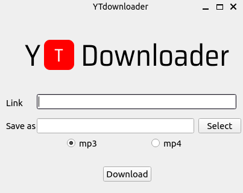

# Yt-Downloader
 
É um software construído para baixar vídeos diretamente do youtube. 
Para isso, basta informar a url do vídeo, o nome e local que deseja 
salvá-lo em sua máquina e o formato que deseja, seja para vídeo ou 
para converte-lo em aúdio (mp3 e mp4 suportados somente).

## Tecnologias

